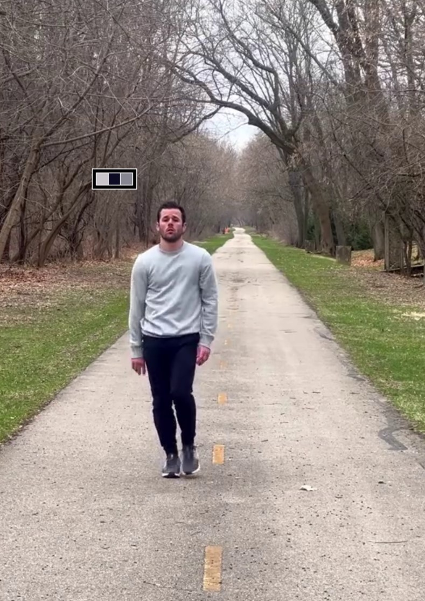
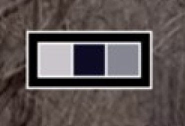
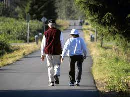
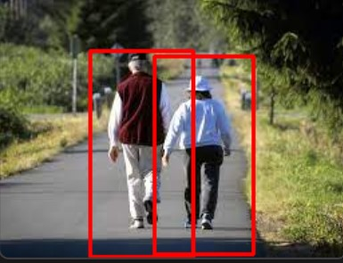
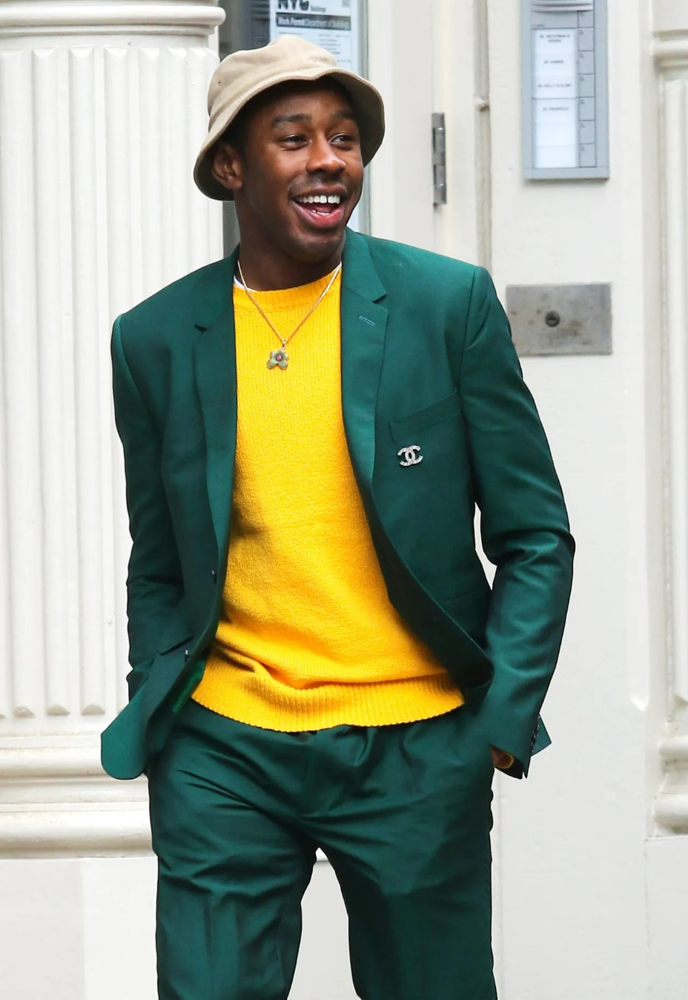
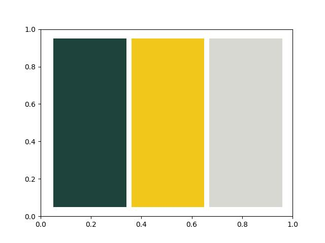

# outfit-color
Image processing Team Project 02  
Outfit color analyzer using OpenCV technology.  

### Color of clothes

# Key features we have focused on
## - Pedestrian detection
### Input  

### Output  
 

## - Clothes color detection
### Input
 

### Output
 

> - video source: https://www.youtube.com/watch?v=tB-0oWBuK7A
> 
> - image source: https://www.gq.com/story/why-normal-ass-clothes-are-the-best-way-to-dress-right-now
> 
