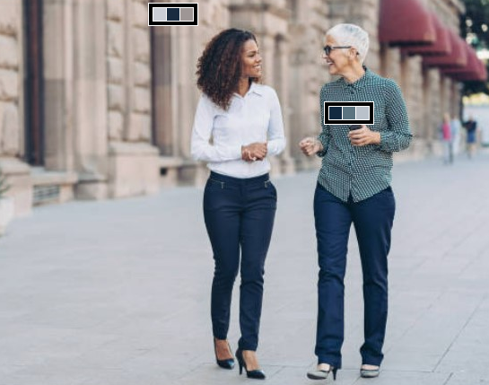

# outfit-color
Image processing Team Project 02  
Outfit color analyzer using OpenCV technology.  




### Color of clothes


## Contents
1. [Environment Setup](#environment-setup)
2. [Demo](#demo)
3. [Key features we have focused on](#key-features-we-have-focused-on)

---
## Environment setup
This code has been tested on Ubuntu 16.04, Python 3.6, Pytorch 0.4.1, CUDA 9.2, RTX 2080 GPUs

- Clone the repository 
```
git clone git@github.com:JoeSeongchan/outfit-color.git && cd outfit-color
```
- Setup python environment
```
pip install -r requirements.txt
```
---
## Demo
- [Setup](#environment-setup) your environment
- Download video and put video file in 'videos' directory
- Run `demo.py`

```shell
cd src
python main.py ..\\videos\\{video_name}
```

## Key features we have focused on
### - Pedestrian detection
#### Input  


#### Output  
 

### - Clothes color detection
#### Input
 

#### Output
 

> - video source: https://www.youtube.com/watch?v=tB-0oWBuK7A
> 
> - image source: https://www.gq.com/story/why-normal-ass-clothes-are-the-best-way-to-dress-right-now
> 
